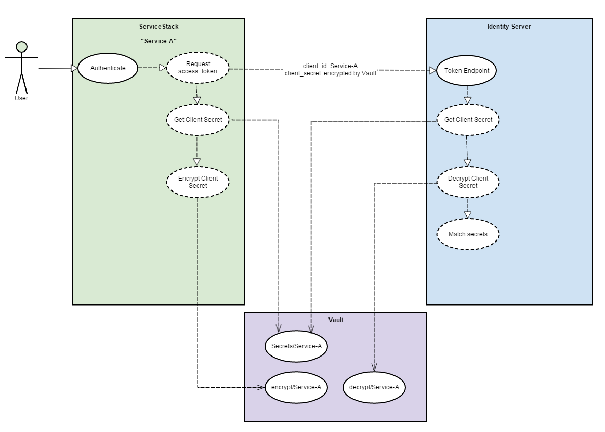

# Vault as a ClientSecretStore

Two plugins, one for ServiceStack and one for IdentityServer3 that allow [Vault](https://www.vaultproject.io/) to be used as a common *Client Secret* data store.

* IdentityServer3.Contrib.Vault.ClientSecretStore - Contains a plugin to retrieve Client and Scope secrets from Vault.
* ServiceStack.Authentication.IdentityServer.Vault - Contains the IdentityServerVaultAuthFeature which is just an extension of the IdentityServerAuthFeature plugin

## Overview
IdentityServer, in order to authenticate a Client (where a Client is an API / Website / Web app etc) requires a *Client Id* and a *Client Secret* be passed from the Client to the Identity Server instance.  Both the Client and the IdentityServer instance need to have access to these secrets but also must keep these secrets safe.  The Identity Server instance must be able to confirm that the *Client Secret* it receives is valid for the *Client Id*.  Vault will act as a data store for these Client Secrets where both the Client and IdentityServer instance can request these secrets.  This removes the responsiblity of keeping these secrets safe, and in sync from the Client and IdentityServer to Vault.

## Quickstart

### Prerequisites
Vault is assumed to have been setup with the following backends:
* [App ID Auth Backend](https://www.vaultproject.io/docs/auth/app-id.html)    
* [Transit Secret Backend](https://www.vaultproject.io/docs/secrets/transit/index.html)

In addition, the following vault configurations must have been set up:
* AppId/UserId tokens have been created for Service Stack Client
    * Create AppId
    * Create UserId
    * Map UserId to AppId
    
* AppId/UserId tokens have been created for IdentityServer
    * Create AppId
    * Create UserId
    * Map UserId to AppId

* A Transit Secret Backend Encryption Key has been created for the Client Id

See [here](vault.md) for information on how to configure Vault for the steps below:

### Identity Server Plugin
First add the following package to the Identity Server instance:
<pre>
<code>
    PM> Install-Package IdentityServer3.Contrib.Vault.ClientSecretStore
</code>
</pre>

Add the following to the OWIN startup class of your IdentityServer instance:
<pre>
<code>
    public void Configuration(IAppBuilder app)
    { 
        var factory = new IdentityServerServiceFactory()
        ...
        
        factory.RegisterClientDataStore(new Registration&lt;IClientDataStore&gt;(resolver => 
            new InMemoryClientDataStore(Clients.Get()))                     // Replace with implementation of IClientDataStore
        );                                                                  // NOTE!!!: Not IClientStore
        factory.RegisterScopeDataStore(new Registration&lt;IScopeDataStore&gt;(resolver => 
            new InMemoryScopeDataStore(Scopes.Get()))                       // Replace with implementation of IScopeDataStore
        );                                                                  // NOTE!!!: Not IScopeStore
        factory.AddVaultClientSecretStore(
                new VaultClientSecretStoreAppIdOptions
                {
                    VaultUrl = "http://127.0.0.1:8200",                     // The ip address and port that vault is on
                    
                    AppId = "146a3d05-2042-4855-93ba-1b122e70eb6d",         // The IdentityServer AppId for AppId Authentication Backend
                    UserId = "976c1095-a7b4-4b6f-8cd8-d71d860c6a31"         // The IdentityServer UserId for AppId Authentication Backend
                });
        ...
    }
</code>
</pre>

### Service Stack Plugin
Add the following package to the ServiceStack instance:
<pre>
<code>
    PM> Install-Package IdentityServer3.Contrib.Vault.ClientSecretStore
</code>
</pre>

Add the following to your AppHost:
<pre>
<code>
    public class AppHost : AppSelfHostBase
    {
        ...
        
        public override void Configure(Container container)
        {
            ...
            
            // The IdentityServer AppId for AppId Authentication Backend
            AppSettings.Set("vault.app-id", "f8a5a40f-ecd9-43da-a009-82f180e1ef84");
            
            // The IdentityServer UserId for AppId Authentication Backend
            AppSettings.Set("vault.user-id", "27ded1df-7aca-40ba-a825-cc9bf5cb7f88");                                
            
            AppSettings.SetUserAuthProvider()                           // Service Stack Identity Server Configuraiton
                       .SetAuthRealm("http://localhost:5000/")
                       .SetClientId("clientid ....")
                       .SetScopes("openid etc ....");

            Plugins.Add(new IdentityServerVaultAuthFeature());          // IdentityServer Auth Provider with Vault Secret Store
            
            ...
        }
    }  
</code>
</pre>

Provided all the external configuration is correct that should be enough to use Vault as the Client Secret Store.

## Under the Covers...

### Vault Authentication
Both IdentityServer and our Client require access to Vault to retrieve a secret.  Vault supports a number of methods of authentication using an *Auth Backend*.
Possible methods of authentication are:
* [AppId](https://www.vaultproject.io/docs/auth/app-id.html) - a unique combination of both an App ID and a User ID token.   Both must be unique and the combination of the two determines the privileges in Vault.
* [GitHub](https://www.vaultproject.io/docs/auth/github.html) - authentication is done via a GitHub Api Token
* [LDAP](https://www.vaultproject.io/docs/auth/ldap.html) - ldap user & password credentials
* [Token](https://www.vaultproject.io/docs/auth/token.html) - a single token to authenticate
* [Username / Password](https://www.vaultproject.io/docs/auth/userpass.html) - a username and password combination
Depending on the Auth Backend chosen, there may be configuration required to "mount the backend".

When a Client authenticates against Vault they are issued with a Vault Auth token which must be in the http request header of any subsequent requests (the "X-Vault-Token" header).

Currently only the AppId is supported but further backends may be supported at a later date.

### Vault Generic Secret Backend
It is assumed that a list of secrets has been created and stored in Vault for the Client.  The Client will retrieve one of these secrets for passing to IdentityServer.

*Note: Storing a list of secrets and selecting one at random allows secrets to be rotated / added / removed by an external secret management process that would in turn make it harder to guess and reduces the time in which a secret is valid (replay attacks etc).*

Vault provides a [generic secret backend](https://www.vaultproject.io/docs/secrets/generic/index.html) that can be used to store the secrets for the client using an api endpoint e.g.
    /secret/services/client-secrets/0cb13ff8-184e-42f7-9c89-76515df1fee0
Where the GUID is the Client ID for the service. IdentityServer will know where to retrieve the Client Secret from as it is given the Client ID as part of the request.

### Vault Transit Backend
As the Client will be transmitting the Client Secret out into the wild, the [Vault Transit Backend](https://www.vaultproject.io/docs/secrets/transit/index.html) can be used to encrypt the Client Secret such that IdentityServer can also use Vault to decrypt the Client Secret.  Neither the Client(s) nor IdentityServer need to worry about sharing encryption / decryption libraries and public / private keys.

An external process would be responsible for creating a *transit key endpoint* that can be used by both the Client and IdentityServer so that the Client would encrypt the secret using the api endpoint:
    /transit/encrypt/0cb13ff8-184e-42f7-9c89-76515df1fee0
    
IdentityServer would be able to decrypt the secret using the api endpoint:
    /transit/decrypt/0cb13ff8-184e-42f7-9c89-76515df1fee0
    
Where the GUID is the Client ID.  IdentityServer will know how to decrypt as it is given the Client ID is part of the request.

### Client to Identity Server
When the Client authenticates with IdentityServer, it passes the Client ID and the encrypted Client Secret.
IdentityServer provides an IClientStore and an IScopeStore interface for retrieving Client and Scope data, including the secrets for these.  
The IdentityServer plugin injects new versions of these, *IClientDataStore* and *IScopeDataStore* which are workarounds for the IdentityServer IOC Container.

### IdentityServer Vault Secret Validation
IdentityServer validates the Client Secret using the following steps:
* Decrypt the Client Secret using the Vault Transit Backend
* Retrieve the list of Secrets stored for the Client
* Compare the decrypted secret against the list of secrets
If IdentityServer is able to match the decrypted secret against the list of secrets from Vault then it authenticated the Client Secret. It would then continue as normal with client / scope validation etc.